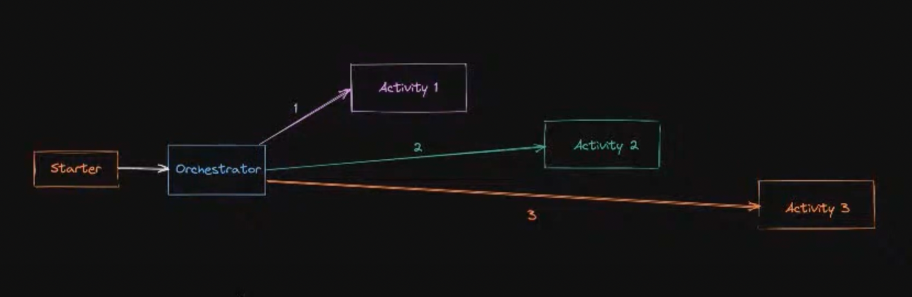

##  Prerequisites

Based on [Azure Durable Functions - Introduction & Chaining (TypeScript)](https://github.com/marcduiker/azure-functions-university/tree/main/lessons/typescript/durable-functions/chaining)

- A local folder with a Function App.  
- The [Azure Functions extension](https://marketplace.visualstudio.com/items?itemName=ms-azuretools.vscode-azurefunctions) for VSCode.  
- The [Microsoft Azure Storage Emulator](https://docs.microsoft.com/azure/storage/common/storage-use-emulator)  
- The [Azure Storage Explorer](https://azure.microsoft.com/features/storage-explorer/)  

## Resources

  - [Use the Azurite emulator for local Azure Storage development](https://docs.microsoft.com/en-gb/azure/storage/common/storage-use-azurite?toc=%2Fazure%2Fstorage%2Fblobs%2Ftoc.json&tabs=visual-studio-code)

 - [Docs To lesson](https://github.com/marcduiker/azure-functions-university/tree/main/lessons/typescript/durable-functions/chaining)

 - [Azure Functions University - Durable Functions Lesson I Video](https://youtu.be/gE130BITP9g)

 ## More info

* Azure Durable Functions - [Official Documentation](https://docs.microsoft.com/azure/azure-functions/durable/)
* JavaScript: [Generator functions](https://developer.mozilla.org/docs/Web/JavaScript/Reference/Statements/function*) and [Yield](https://developer.mozilla.org/docs/Web/JavaScript/Reference/Operators/yield)
* Azure Durable Functions - [Automatic retries](https://docs.microsoft.com/azure/azure-functions/durable/durable-functions-error-handling?tabs=javascript#automatic-retry-on-failure)
* Azure Durable Functions - [Function timeouts](https://docs.microsoft.com/azure/azure-functions/durable/durable-functions-error-handling?tabs=javascript#function-timeouts)
* More info on the [circuit breaker pattern](https://docs.microsoft.com/azure/architecture/patterns/circuit-breaker)
* [GitHub REST API](https://docs.github.com/en/rest)
* Alternative to code-based workflows in Microsoft Azure: [Azure Logic Apps](https://azure.microsoft.com/services/logic-apps/)

